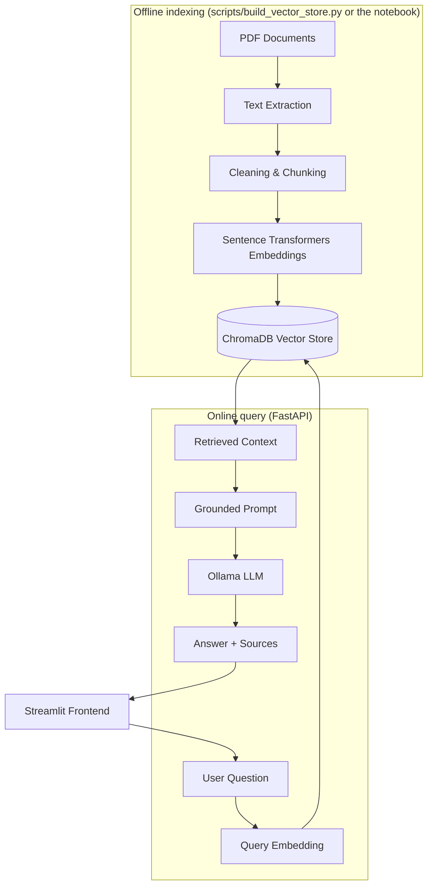

# 📊 DataMind RAG Assistant

A **Retrieval-Augmented Generation (RAG)** assistant for Data Analysis, Python
data tools, SQL, visualization, statistics, and AI/ML fundamentals.
DataMind answers strictly from a document corpus — it is instructed to say
so explicitly when its documents don't contain enough information, rather
than falling back on the LLM's own general knowledge.

Built with **FastAPI + ChromaDB + Sentence Transformers + Ollama + Streamlit**,
100% local and free to run (no paid APIs required).

---

## Table of Contents

- [Features](#features)
- [Architecture](#architecture)
- [Tech Stack](#tech-stack)
- [Project Structure](#project-structure)
- [Data Sources](#data-sources)
- [Installation](#installation)
- [Ollama Setup](#ollama-setup)
- [Download Documents](#download-documents)
- [Build the Vector Store](#build-the-vector-store)
- [Run the Backend](#run-the-backend)
- [Run the Frontend](#run-the-frontend)
- [API Reference](#api-reference)
- [Evaluation](#evaluation)
- [Screenshots](#screenshots)
- [Troubleshooting](#troubleshooting)

---

## Features

- 🔍 **Retrieval-augmented, grounded answers** — every response is generated
  from chunks retrieved out of the document corpus, with an explicit
  instruction to the LLM not to invent facts.
- 📄 **Source citations** — every answer lists the document and page number
  it drew from.
- 💬 **Chat-style Streamlit UI** with persistent session chat history,
  a loading spinner, an expandable "Sources" panel, and friendly error
  messages if the backend or Ollama is unreachable.
- ⚡ **FastAPI backend** with `/health` and `/query` endpoints, CORS
  configured for the frontend origin, and heavy resources (embedding model +
  vector store) loaded once at startup — never per-request.
- 🧠 **100% local, free stack**: local embeddings (Sentence Transformers),
  local vector database (ChromaDB), local LLM (Ollama). No API keys needed.
- ✅ **Tested**: pytest suite covering the happy path, input validation, and
  retrieval correctness, with Ollama mocked so tests don't require a live
  LLM service.
- 📓 **Educational notebook** (`notebooks/rag_pipeline.ipynb`) walking
  through the entire pipeline — extraction, cleaning, chunking, embeddings,
  ChromaDB, retrieval, grounded prompting, generation, and evaluation — that
  runs top-to-bottom from a fresh kernel.

## Architecture



## Tech Stack

| Layer | Technology |
|---|---|
| Language | Python 3.11+ |
| Notebook / exploration | Jupyter, pypdf |
| Embeddings | Sentence Transformers (`all-MiniLM-L6-v2`), local & free |
| Vector database | ChromaDB (persistent, on-disk) |
| LLM | Ollama (local, e.g. `llama3.2`) |
| Backend API | FastAPI + Uvicorn, Pydantic / pydantic-settings |
| Frontend | Streamlit |
| Testing | Pytest + FastAPI TestClient + httpx |

## Project Structure

```
rag-assistant-app/
│
├── notebooks/
│   └── rag_pipeline.ipynb        # Full educational pipeline walkthrough
│
├── data/
│   ├── documents/                # PDF corpus (source documents)
│   ├── document_sources.json     # Where each official PDF came from
│   └── vector_store/             # Persistent ChromaDB store (generated)
│
├── scripts/
│   ├── download_documents.py     # Downloads the official PDFs
│   ├── generate_sample_notes.py  # Generates original supplementary notes as PDFs
│   ├── sample_notes_content.py   # Original text content used above
│   ├── rag_pipeline_lib.py       # Shared extract/clean/chunk/embed/store logic
│   └── build_vector_store.py     # Runs the full indexing pipeline as a script
│
├── backend/
│   ├── app/
│   │   ├── main.py               # FastAPI app, lifespan, CORS
│   │   ├── api/routes/query.py   # GET /health, POST /query
│   │   ├── core/config.py        # Environment-driven settings
│   │   ├── schemas/query.py      # Pydantic request/response models
│   │   ├── services/retrieval.py # ChromaDB + embedding model loading & search
│   │   ├── services/generation.py# Grounded prompt + Ollama call
│   │   └── utils/logging_config.py
│   ├── tests/test_query.py
│   ├── requirements.txt
│   ├── .env.example
│   └── Dockerfile
│
├── frontend/
│   ├── app.py                    # Streamlit chat UI
│   ├── api_client.py             # HTTP client for the backend
│   ├── requirements.txt
│   └── .env.example
│
├── screenshots/
├── .gitignore
├── README.md
└── requirements.txt
```

## Data Sources

The bundled corpus in `data/documents/` combines two kinds of sources (full
provenance recorded in [`data/document_sources.json`](data/document_sources.json)):

1. **Official, publicly available documentation PDFs**, downloaded by
   `scripts/download_documents.py`:
   - **Pandas Cheat Sheet** — official quick-reference maintained in the
     [pandas-dev/pandas](https://github.com/pandas-dev/pandas) repository.
   - **NumPy v2.0 User Guide** — official PDF published by the NumPy
     project (`numpy.org/doc/2.0/numpy-user.pdf`).
   - **Matplotlib 2.0.2 documentation** — the most recent officially-hosted
     PDF release from the Matplotlib project (current Matplotlib docs are
     HTML/ZIP only; PDF generation was discontinued upstream for newer
     versions, so this is the latest one that still exists as an official
     PDF).

2. **Original study notes**, authored specifically for this project and
   rendered to PDF by `scripts/generate_sample_notes.py`, covering topics
   where no current, freely-redistributable official PDF exists (SQL,
   statistics fundamentals, exploratory data analysis, machine learning
   fundamentals, and AI/generative AI fundamentals). These are plain,
   original writing — not copied from any book or third-party site — and
   exist purely so the demo corpus has reasonable topic coverage out of the
   box.

**You are encouraged to replace/extend this corpus.** Drop your own
legitimately-sourced PDFs (official docs, open-access books, your course
material, etc.) into `data/documents/` and re-run
`python scripts/build_vector_store.py` — the pipeline re-indexes whatever
is in that folder.

## Installation

```bash
git clone <your-fork-or-repo-url>
cd rag-assistant-app

python -m venv .venv
```

Activate the virtual environment:

- **Windows**: `.venv\Scripts\activate`
- **Linux/macOS**: `source .venv/bin/activate`

### Install Dependencies

```bash
# Everything (notebook + backend + frontend):
pip install -r requirements.txt

# OR, if you only want to run one service:
pip install -r backend/requirements.txt   # backend only
pip install -r frontend/requirements.txt  # frontend only
```

## Ollama Setup

1. Install Ollama from **[ollama.com](https://ollama.com)** (Windows,
   macOS, and Linux installers available).
2. Pull the model this project defaults to:
   ```bash
   ollama pull llama3.2
   ```
3. Verify Ollama is running:
   ```bash
   ollama list
   ```
   You should see `llama3.2` in the list. Ollama typically runs a local
   server at `http://localhost:11434` automatically after installation.
4. The backend talks to Ollama via the official
   [`ollama` Python package](https://pypi.org/project/ollama/)
   (`backend/app/services/generation.py`), configured via the
   `OLLAMA_MODEL` and `OLLAMA_BASE_URL` environment variables — see
   `backend/.env.example`.

## Download Documents

```bash
python scripts/download_documents.py
python scripts/generate_sample_notes.py
```

The first script downloads the official PDFs listed in
`data/document_sources.json` (skipping any already downloaded, and
validating that each download is a real PDF). The second renders the
original supplementary study notes described above. Both are safe to
re-run at any time.

## Build the Vector Store

Either run the script:

```bash
python scripts/build_vector_store.py
```

or run `notebooks/rag_pipeline.ipynb` top-to-bottom — both use the exact
same pipeline logic in `scripts/rag_pipeline_lib.py`, so their outputs are
equivalent. The script is faster for day-to-day use; the notebook is the
educational/report version with explanations and an evaluation section.

This creates a persistent ChromaDB collection at `data/vector_store/` plus
a `data/vector_store/config.json` recording the embedding model, chunk
size/overlap, and top-k used to build it.

## Run Backend

```bash
cd backend
cp .env.example .env   # adjust if needed
uvicorn app.main:app --reload --port 8000
```

The backend loads the embedding model and ChromaDB collection once at
startup (see the lifespan handler in `app/main.py`). If the vector store
doesn't exist yet, the API still starts, but `/query` will return a clear
`503` telling you to run `build_vector_store.py` first.

## Run Frontend

In a separate terminal:

```bash
cd frontend
cp .env.example .env   # adjust if needed
streamlit run app.py
```

Streamlit will open the chat UI in your browser (default:
`http://localhost:8501`).

## API Reference

### `GET /health`

```json
{
  "status": "ok",
  "vector_store_loaded": true,
  "collection_count": 13
}
```

### `POST /query`

Request:

```json
{
  "question": "What is exploratory data analysis?"
}
```

Response:

```json
{
  "answer": "...",
  "sources": [
    "exploratory_data_analysis_notes.pdf - page 1"
  ],
  "retrieved_chunks": [ ... ],
  "grounded": true
}
```

curl example:

```bash
curl -X POST "http://localhost:8000/query" \
  -H "Content-Type: application/json" \
  -d "{\"question\":\"What is exploratory data analysis?\"}"
```

## Evaluation

The notebook (`notebooks/rag_pipeline.ipynb`, Section 12) runs 10
evaluation questions spanning Pandas, NumPy, EDA, data cleaning, SQL,
Matplotlib, feature engineering, overfitting, train/test split, and
generative AI, and records retrieved sources, a grounding check, and the
generated answer for each, with a `correct` column intentionally left for
manual human review (as recommended by the project guide, rather than
auto-scoring "correctness").

**What was actually verified in this build environment**, and what wasn't
(being transparent rather than fabricating results — see also the
"Remaining manual steps" note at the end of this README):

- ✅ PDF loading, text extraction, cleaning, and chunking were run for real
  against the full 6-document corpus (13 pages → 13 chunks with the default
  800/120-word chunk size/overlap).
- ✅ The FastAPI backend, Pydantic validation, retrieval logic, and grounded
  prompt construction were exercised by the real pytest suite
  (`backend/tests/test_query.py`, 4/4 passing) using a real, temporary
  ChromaDB collection.
- ✅ The retrieval logic was smoke-tested end-to-end against the real
  6-document corpus using the exact same `rag_pipeline_lib.py` functions
  the notebook and `build_vector_store.py` use — a query for *"What is a
  SQL JOIN?"* correctly retrieved the SQL notes document as the top hit
  with an accurate page citation.
- ⚠️ **Not executed in this build environment**: downloading the real
  `sentence-transformers/all-MiniLM-L6-v2` weights from Hugging Face Hub,
  and calling a live Ollama instance — this sandbox has no network access
  to `huggingface.co` and no local Ollama installation. Both will work
  normally on a regular developer machine with internet access and Ollama
  installed; the smoke test above used a lightweight offline stand-in
  *only* to validate the surrounding pipeline wiring, not as a substitute
  for the real model.

**To generate real, fully-populated evaluation results:** clone the repo on
a machine with internet access and Ollama installed, then run:

```bash
python scripts/download_documents.py
python scripts/generate_sample_notes.py
python scripts/build_vector_store.py
jupyter notebook notebooks/rag_pipeline.ipynb   # Kernel → Restart & Run All
```

and review `eval_df` in Section 12.

## Screenshots

Screenshots are not included in this repository yet. After running the app
end-to-end, take a few screenshots of:

1. The Streamlit chat UI with a question and a grounded answer + sources
2. The FastAPI interactive docs at `http://localhost:8000/docs`
3. A terminal showing `pytest` passing

Save them into `screenshots/` (e.g. `screenshots/chat-ui.png`) and they'll
render here once referenced, e.g.:

```markdown

```

## Troubleshooting

| Problem | Fix |
|---|---|
| `Ollama not running` / `502` from `/query` | Start Ollama (`ollama serve` or just open the Ollama app), and confirm `ollama list` shows your model. |
| `model missing` | Run `ollama pull llama3.2` (or whichever model you set in `OLLAMA_MODEL`). |
| `503` from `/query`, "vector store is not loaded" | Run `python scripts/build_vector_store.py`, then restart the backend. |
| `data/documents/` is empty | Run `python scripts/download_documents.py` and `python scripts/generate_sample_notes.py`, or manually drop your own PDFs into that folder. |
| `Port already in use` | Change the port: `uvicorn app.main:app --port 8001`, and update `API_BASE_URL` in `frontend/.env` to match. |
| Python version problems | This project targets Python 3.11+. Check with `python --version`; consider using `pyenv` or a fresh virtual environment if you have multiple Python versions installed. |
| Streamlit can't reach the backend | Confirm the backend is running and `API_BASE_URL` in `frontend/.env` matches its actual host/port. |
| Slow answers | Local LLM generation on CPU can be slow, especially for larger models — try a smaller Ollama model, or be patient; the frontend timeout is 60s by default (`frontend/api_client.py`). |
